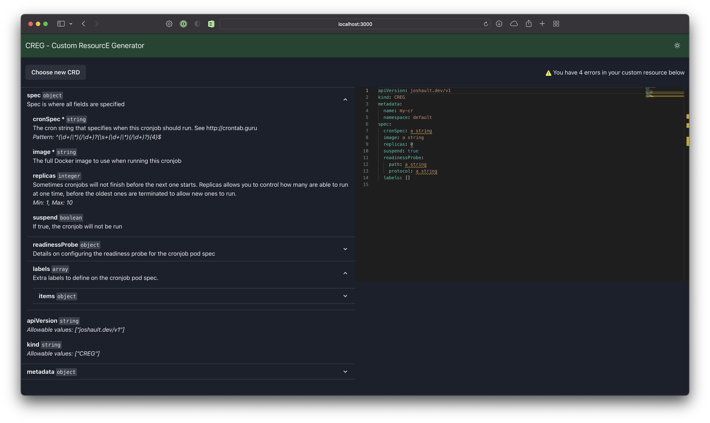

# CREG - Custom ResourcE Generator

CREG is a website for generating and validating a Custom Resource (CR) from a Kubernetes Custom Resource Definition (CRD). CREG can be used to build a CR from scratch, or validate an already existing one to figure out exactly which lines violate the CRD schema.



## Demo

View the demo site here [https://jault3.github.io/creg/](https://jault3.github.io/creg/)

## Deploying

If you want to deploy CREG on your own infrastructure, you can use any of the options below.

### Docker

A Docker image is made available on the GitHub registry.

```
docker pull ghcr.io/jault3/creg:v0.0.1
```

View all versions on the [packages page](https://github.com/jault3/creg/pkgs/container/creg)

### Kubernetes

Kubernetes manifests are provided in the [manifests/](manifests/) directory. You can deploy them with

```
kubectl apply -k https://raw.githubusercontent.com/jault3/creg/v0.0.1/manifests/kustomization.yaml
```

Or use them as a base in your own Kustomization

```
apiVersion: kustomize.config.k8s.io/v1beta1
kind: Kustomization
resources:
- https://raw.githubusercontent.com/jault3/creg/v0.0.1/manifests/kustomization.yaml
patches:
- <your-patch-files>
```

### Static files

Each release creates a `creg-prod.zip` file you can download directly from the [releases page](https://github.com/jault3/creg/releases). These builds assume CREG will be hosted at the root path `/`. If you need to change that path, please see the `Running locally`.

## Running locally

To get up and running locally, run:

```
npm i
npm start
```

If you want to create your own production build, run:

```
npm run build
```

You can also set the `PUBLIC_URL` environment variable if you will be hosting CREG on a path other than `/`. For example:

```
PUBLIC_URL=/creg/ npm run build
```

Take the resulting `build/` directory and deploy it to your own webserver.

## Third Party Libraries

CREG makes use of the following libraries:

* [Chakra UI](https://chakra-ui.com) for a component library
* [React Monaco Editor](https://github.com/react-monaco-editor/react-monaco-editor) for providing [Monaco Editor](https://github.com/microsoft/monaco-editor) as a React component to edit the CR
* [Monaco YAML](https://github.com/remcohaszing/monaco-yaml) to add schema validation for YAML files in Monaco
* [monaco-editor-webpack-plugin](https://www.npmjs.com/package/monaco-editor-webpack-plugin) to make loading Monaco with webpack easier
* [JS-YAML](https://github.com/nodeca/js-yaml) for loading CRD YAML files as objects
* [Craco](https://github.com/gsoft-inc/craco) for being able to use monaco-editor-webpack-plugin without ejecting
